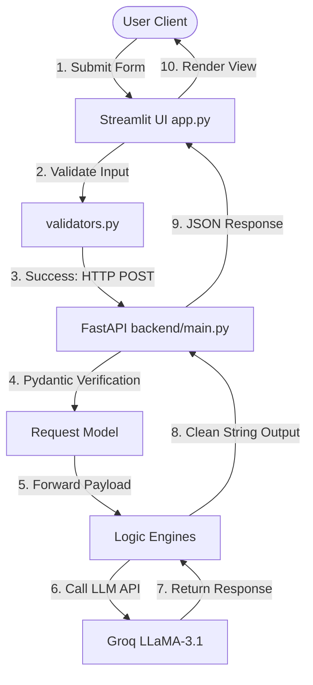
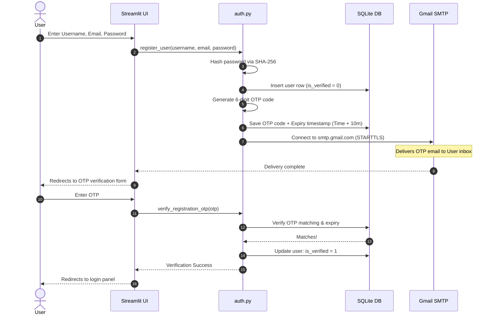
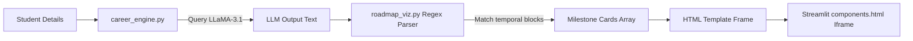
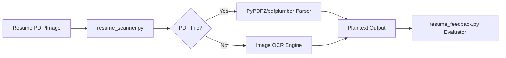
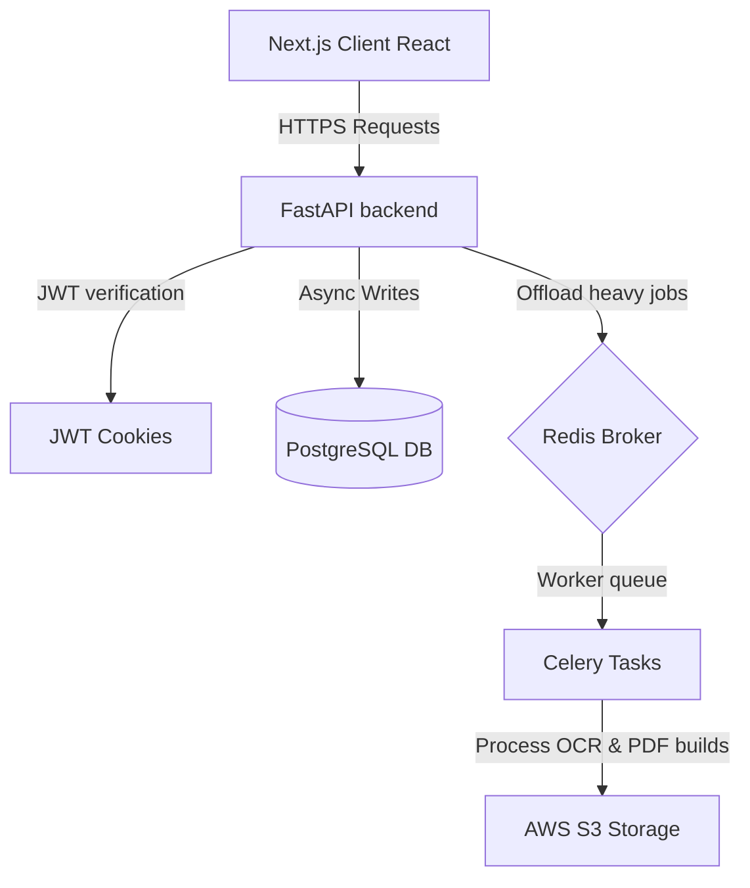

# VidyGuideAI Technical Architecture Spec

This document details the software architecture, design patterns, database schemas, and data pipelines of the VidyGuideAI platform.

---

## 1. System Topology

VidyGuideAI is composed of two decoupled runtime nodes:
1. **Frontend (Streamlit UI)**: A multi-tab dashboard script managing validation, local state variables, and requesting resources from the backend API.
2. **Backend (FastAPI REST Server)**: An asynchronous ASGI web application validation engine communicating with LLM inference channels.

---

## 2. Core Request Flow

---

## 3. Authentication & OTP Verification Flow

The user registration and security flow utilizes a salted SHA-256 hash database store:

---

## 4. Feature Pipelines

### A. Career Recommendation & Roadmap Timeline
Parses and generates interactive timelines using regex patterns:

### B. Resume Scanner (OCR Pipeline)
Parses uploaded resumes using PDF/Image readers:

---

## 5. Database Schema & Models
The local database uses SQLite (`vidyguide.db`) holding `users` and `history` tables linked by foreign key constraints.

See [DATABASE.md](docs/architecture/DATABASE.md) for table schemas and indices.

---

## 6. Future Next.js & Celery Target Architecture
To scale the system for production:

