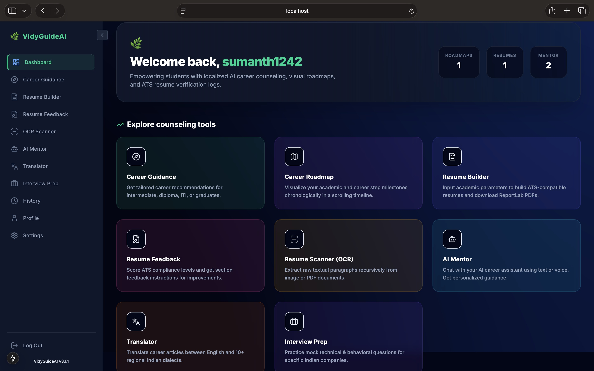
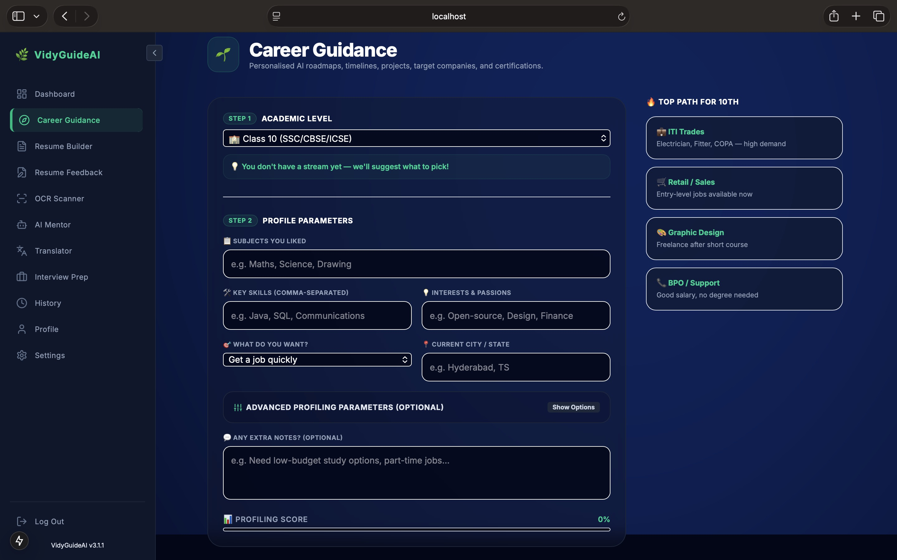
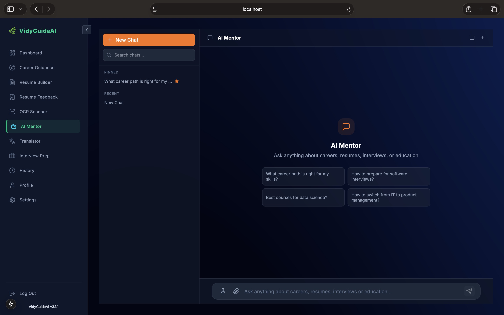
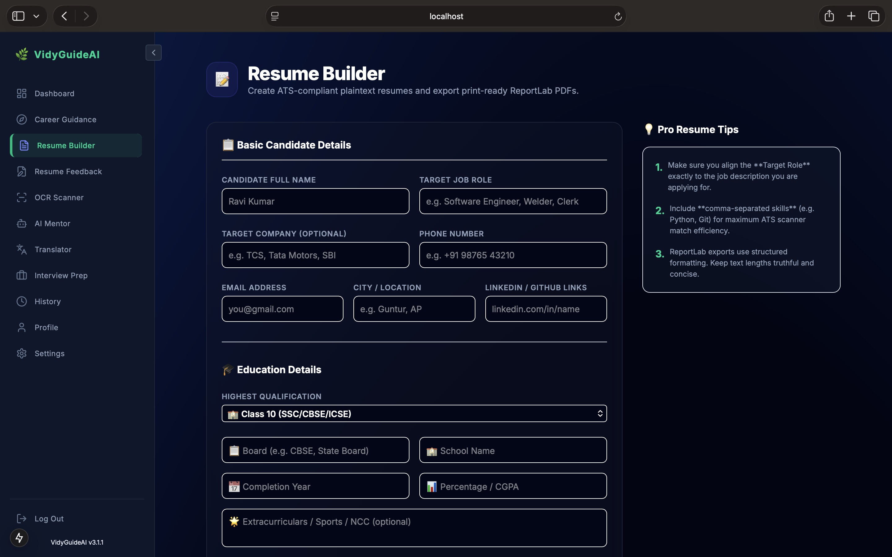
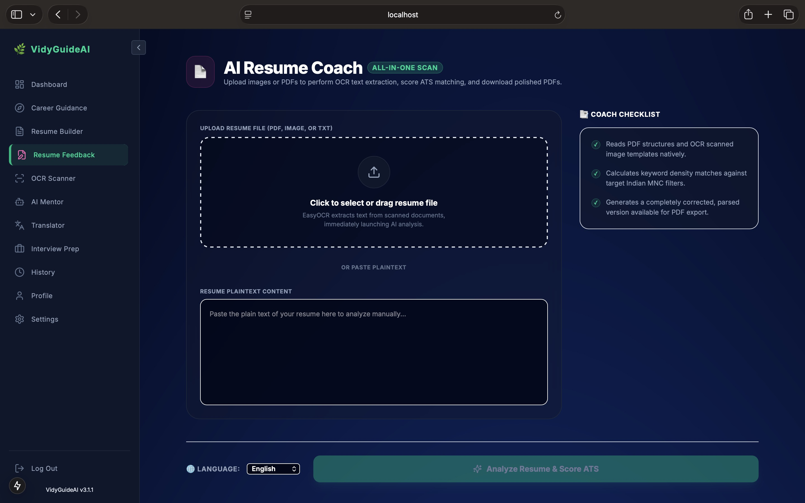
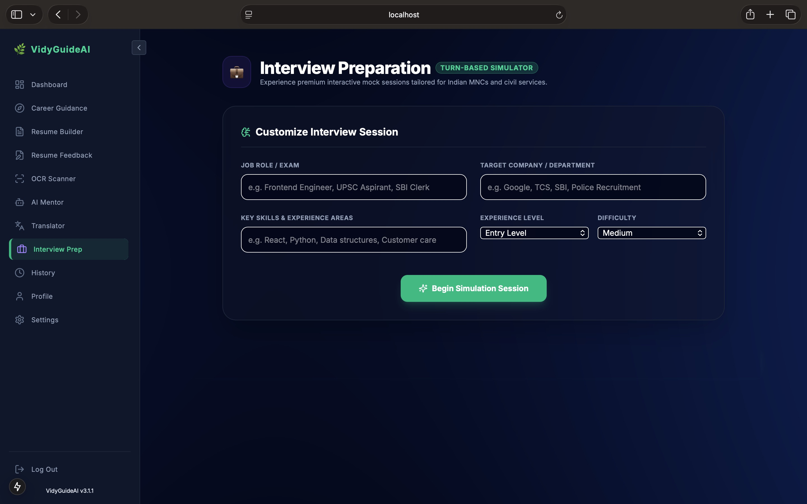
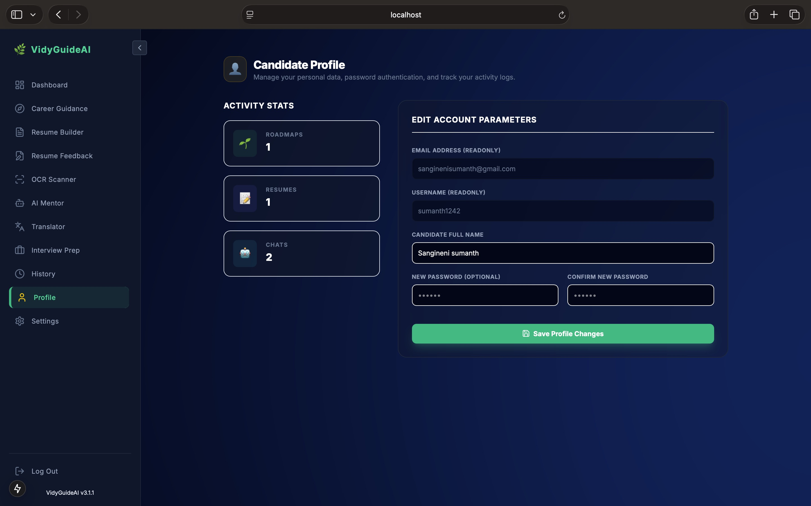
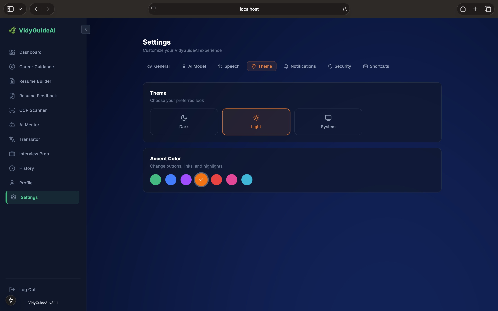
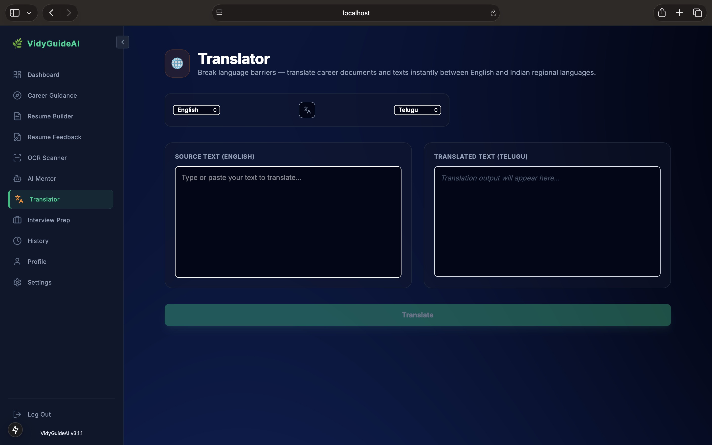

<div align="center">

# 🌿 VidyGuideAI

**AI-Powered Career Counseling Platform for Indian Students**

[](https://nextjs.org/)
[](https://nestjs.com/)
[](https://www.typescriptlang.org/)
[](https://www.prisma.io/)
[](https://www.postgresql.org/)
[](https://groq.com/)
[](LICENSE)
[](https://github.com/sanginenivamshi21-hub/VidyGuideAI/actions)
[](CONTRIBUTING.md)

<sub>Empowering 250M+ Indian students with AI-driven career guidance in 10+ regional languages</sub>

---

[Features](#-features) • [Screenshots](#-screenshots) • [Architecture](#-architecture) • [Tech Stack](#-tech-stack) • [Quick Start](#-quick-start) • [API Overview](#-api-overview) • [Documentation](#-documentation) • [Roadmap](#-roadmap)

</div>

---

## ✨ Features

| Module | Description |
|--------|-------------|
| **🔐 Authentication** | JWT-based registration/login with OTP email verification, forgot/reset password, guest access |
| **🎯 Career Guidance** | Personalized recommendations for 10th/12th/ITI/diploma/graduate students with detailed roadmaps |
| **🗺️ Career Roadmap** | Visual milestone timeline with scroll-triggered animations |
| **📝 Resume Builder** | ATS-compliant plaintext resumes generated via Groq AI |
| **📄 Resume Feedback** | ATS scoring with section-by-section improvement suggestions in multiple languages |
| **🖨️ PDF Export** | Professional PDF generation via ReportLab with Indian formatting standards |
| **🔍 OCR Scanner** | Text extraction from PDF and images via Tesseract OCR engine |
| **🤖 AI Mentor** | Regional language counseling (10+ Indian languages) with streaming responses |
| **🎤 Voice Mentor** | Speech-to-text Q&A with browser SpeechSynthesis output |
| **💼 Interview Prep** | Mock technical and behavioral interviews for top Indian companies with feedback |
| **🌐 Translator** | Career article translation across English + 9 Indian regional languages |
| **⚙️ Settings Sync** | Full user preferences (theme, accent color, AI model, voice, notifications) synced with backend |
| **📊 Dashboard** | Usage analytics, interaction stats, and progress tracking |
| **📜 History** | Complete audit trail of all user interactions with search and delete |

---

## 📸 Screenshots

<div align="center">

### Landing Page


### Dashboard


### Career Guidance


### AI Mentor Chat


### Resume Builder


### Resume Feedback


### Interview Preparation


### History


### Profile


### Settings


### Translator


</div>

---

## 🏗️ Architecture

```
┌──────────────────────────────────────────────────────────┐
│                    Next.js 15 Frontend                    │
│  (React 19, Tailwind CSS 4, Framer Motion, Lucide Icons)  │
└──────────────────┬───────────────────────────────────────┘
                   │ HTTP/JSON with credentials (cookies)
                   ▼
┌──────────────────────────────────────────────────────────┐
│                   NestJS 11 API Gateway                    │
│   Helmet · CORS · Rate Limiting · Validation · JWT Auth   │
├──────────────────────────────────────────────────────────┤
│  Auth │ Career │ Resume │ Mentor │ OCR │ Translator        │
│  Users │ History │ Conversations │ Settings │ AI │ Mail    │
└───────┬──────────────────────────────────────┬───────────┘
        │                                      │
        ▼                                      ▼
┌──────────────────┐              ┌────────────────────────┐
│   PostgreSQL 16   │              │   Groq AI (LLaMA 3)    │
│   + Prisma ORM    │              │   + SMTP (Nodemailer)  │
│   + Migrations    │              │   + Cloudinary Files   │
└──────────────────┘              └────────────────────────┘
```

---

## 🛠️ Tech Stack

| Layer | Technology |
|-------|-----------|
| **Frontend** | Next.js 15.1 (App Router), React 19, TypeScript, Tailwind CSS 4, Framer Motion, Lucide Icons |
| **Backend** | NestJS 11, TypeScript, Passport JWT, Helmet, Throttler (60 req/min) |
| **Database** | PostgreSQL 16, Prisma ORM 5.21 with migrations |
| **AI/ML** | Groq SDK (llama3-70b, llama3-8b, Gemma 2, Mixtral, DeepSeek R1), Tesseract OCR |
| **Infrastructure** | pnpm workspaces (monorepo), Docker Compose, GitHub Actions |
| **Email** | Nodemailer with SMTP (Gmail, etc.) |
| **File Uploads** | Cloudinary for profile pictures |
| **Security** | bcryptjs, JWT access + refresh tokens, HTTP-only cookies, Helmet headers, rate limiting |

---

## 🚀 Quick Start

### Prerequisites

- Node.js >= 18
- pnpm (`npm install -g pnpm`)
- PostgreSQL 16
- Groq API key ([get one free](https://console.groq.com/))

### Local Development

```bash
# 1. Clone the repository
git clone https://github.com/sanginenivamshi21-hub/VidyGuideAI.git
cd VidyGuideAI

# 2. Install dependencies
pnpm install

# 3. Configure environment
cp .env.example .env
# Edit .env with your credentials (Groq API key, SMTP, DB URL)

# 4. Set up the database
cd apps/api
npx prisma generate
npx prisma migrate deploy
cd ../..

# 5. Start development servers
pnpm dev
```

**API:** `http://localhost:8000` — **Web:** `http://localhost:3000`

### Environment Variables

| Variable | Required | Description |
|----------|----------|-------------|
| `GROQ_API_KEY` | ✅ | Groq AI API key |
| `DATABASE_URL` | ✅ | PostgreSQL connection string |
| `JWT_SECRET` | ✅ | JWT signing secret (min 16 chars) |
| `SMTP_HOST` | ✅ | SMTP server host |
| `SMTP_USER` | ✅ | SMTP email address |
| `SMTP_PASS` | ✅ | SMTP app password |
| `APP_BASE_URL` | ❌ | Base URL for email links (default: `http://localhost:3000`) |
| `NEXT_PUBLIC_API_URL` | ❌ | API URL for frontend (default: `http://localhost:8000`) |
| `REDIS_URL` | ❌ | Redis connection string |
| `CLOUDINARY_URL` | ❌ | Cloudinary for file uploads |

### Docker

```bash
# Build and run all services (PostgreSQL + Redis + API + Web)
docker compose up --build
```

---

## 📖 API Overview

Full API documentation: [`docs/API.md`](docs/API.md)

| Category | Endpoints | Auth |
|----------|-----------|------|
| **Auth** | `POST /auth/register`, `/login`, `/verify-otp`, `/forgot-password`, `/reset-password`, `/logout` | - |
| **Career** | `POST /career`, `/career/roadmap` | ✅ |
| **Resume** | `POST /resume`, `/resume/feedback`, `/resume/pdf` | ✅ |
| **OCR** | `POST /ocr/scan` | ✅ |
| **Mentor** | `POST /mentor`, `/mentor/stream`, `/mentor/interview`, `/mentor/interview/feedback` | ✅ |
| **Conversations** | `GET/POST /conversations`, `GET/PUT/DELETE /conversations/:id`, `POST /conversations/:id/messages` | ✅ |
| **Translator** | `POST /translator` | ✅ |
| **Settings** | `GET/PUT /settings` | ✅ |
| **Users** | `GET/PUT /users/profile`, `POST/DELETE /users/profile/picture`, `DELETE /users/account`, `GET /users/export` | ✅ |
| **History** | `GET/POST /history`, `DELETE /history/:id`, `DELETE /history` | ✅ |

---

## 📂 Project Structure

```
VidyGuideAI/
├── apps/
│   ├── api/                    # NestJS backend (15 modules)
│   │   ├── prisma/             # Schema, migrations, client
│   │   ├── src/
│   │   │   ├── auth/           # JWT auth, OTP, guards, strategies
│   │   │   ├── career/         # Career guidance & roadmaps
│   │   │   ├── mentor/         # AI mentor chat & interviews
│   │   │   ├── resume/         # Resume generation, feedback, PDF
│   │   │   ├── ocr/            # PDF/image text extraction
│   │   │   ├── translator/     # Multilingual translation
│   │   │   ├── conversations/  # Chat history CRUD
│   │   │   ├── users/          # Profile management
│   │   │   ├── settings/       # User preferences
│   │   │   ├── history/        # Interaction audit trail
│   │   │   ├── mail/           # SMTP email service
│   │   │   ├── ai/             # Groq AI integration
│   │   │   ├── database/       # Prisma ORM service
│   │   │   ├── common/         # Shared utilities
│   │   │   └── config/         # Environment validation
│   │   └── test/               # E2E tests
│   └── web/                    # Next.js frontend (14 pages)
│       ├── app/                # App Router pages
│       ├── components/         # Shared UI components
│       ├── hooks/              # Custom React hooks
│       ├── lib/                # API client & route constants
│       └── types/              # TypeScript declarations
├── docker/                     # Dockerfiles
├── docs/                       # Documentation
├── screenshots/                # App screenshots
├── .github/                    # CI/CD, issue/PR templates
├── resume_pdf.py               # Python PDF generator
├── resume_scanner.py           # Python OCR scanner
└── docker-compose.yml          # Full-stack orchestration
```

---

## 🧪 Testing

```bash
# API unit and E2E tests
cd apps/api
pnpm test
pnpm test:e2e

# Frontend build validation
cd apps/web
pnpm build

# Full repository lint
pnpm lint
```

---

## 🗺️ Roadmap

- [x] V3 Architecture (NestJS + Next.js + PostgreSQL)
- [x] JWT Auth with OTP email verification
- [x] Groq AI integration (resume, mentor, career)
- [x] AI Mentor with streaming responses
- [x] PDF export via ReportLab
- [x] OCR engine (Tesseract)
- [x] 10+ Indian language support
- [x] Mock interview system with feedback
- [x] Voice input/output mentor
- [x] Full settings synchronization
- [x] Conversation history with pinning
- [ ] OAuth (Google/GitHub login)
- [ ] Admin dashboard
- [ ] pgvector semantic search
- [ ] CI/CD production deployment pipeline
- [ ] Mobile-responsive PWA
- [ ] Performance monitoring & analytics

---

## 🤝 Contributing

Contributions are welcome! Please read [CONTRIBUTING.md](CONTRIBUTING.md) for guidelines.

- Report bugs via [GitHub Issues](https://github.com/sanginenivamshi21-hub/VidyGuideAI/issues)
- Submit fixes via [Pull Requests](https://github.com/sanginenivamshi21-hub/VidyGuideAI/pulls)
- View our [Code of Conduct](CODE_OF_CONDUCT.md)
- Report security vulnerabilities in [SECURITY.md](SECURITY.md)

---

## 📄 License

MIT © [Vamshi Sangineni](https://github.com/sanginenivamshi21-hub)

---

<div align="center">
  <sub>Built with ❤️ using
  <a href="https://nextjs.org/">Next.js</a> ·
  <a href="https://nestjs.com/">NestJS</a> ·
  <a href="https://www.prisma.io/">Prisma</a> ·
  <a href="https://groq.com/">Groq AI</a>
  </sub>
</div>
